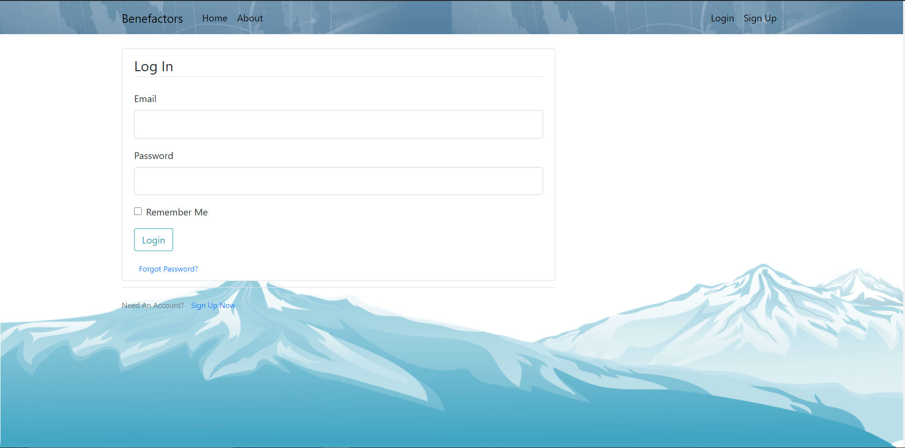
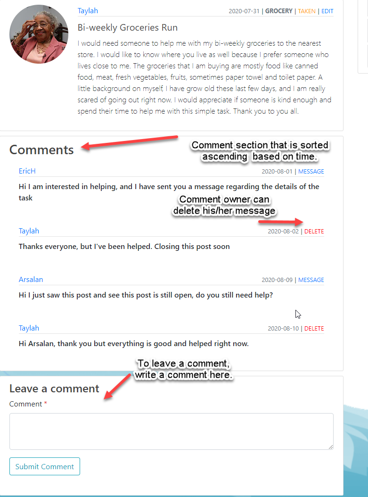
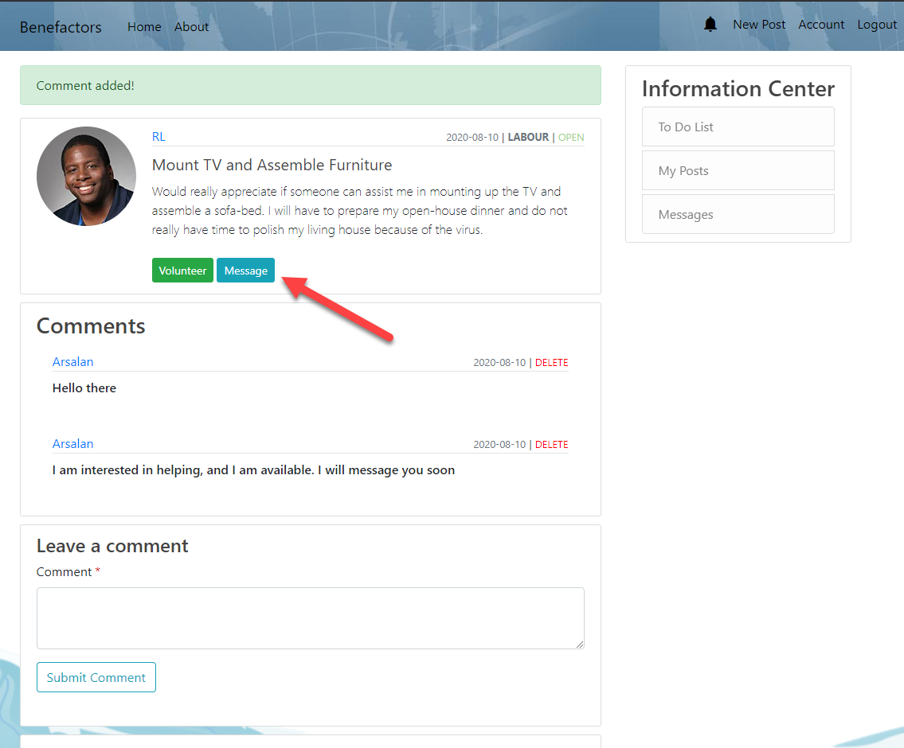
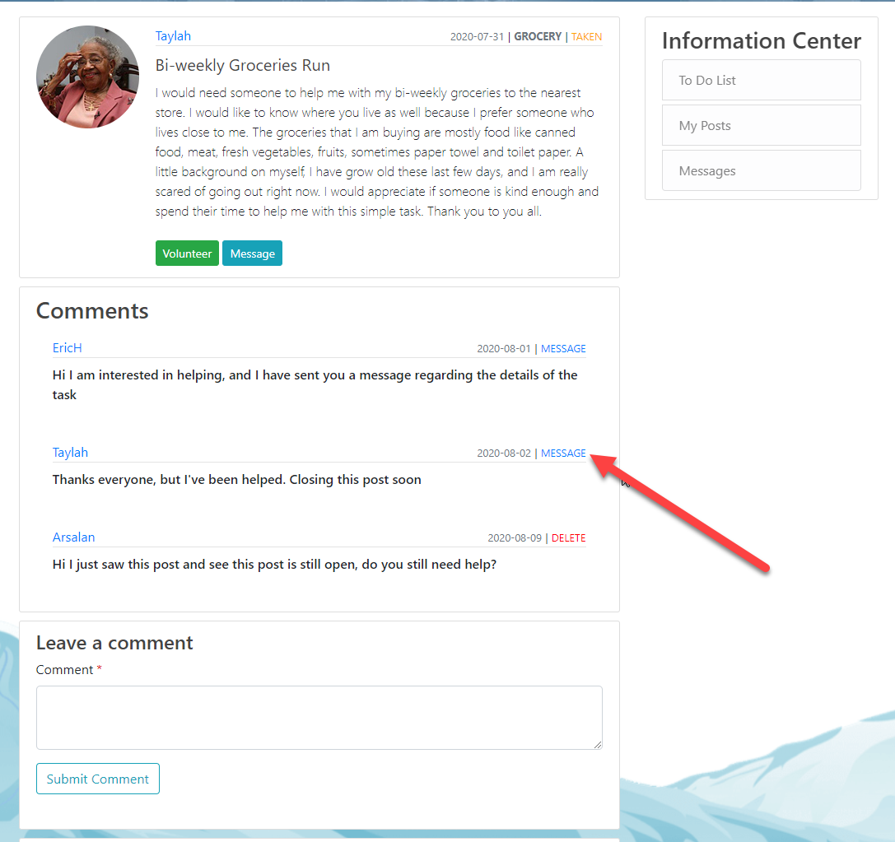
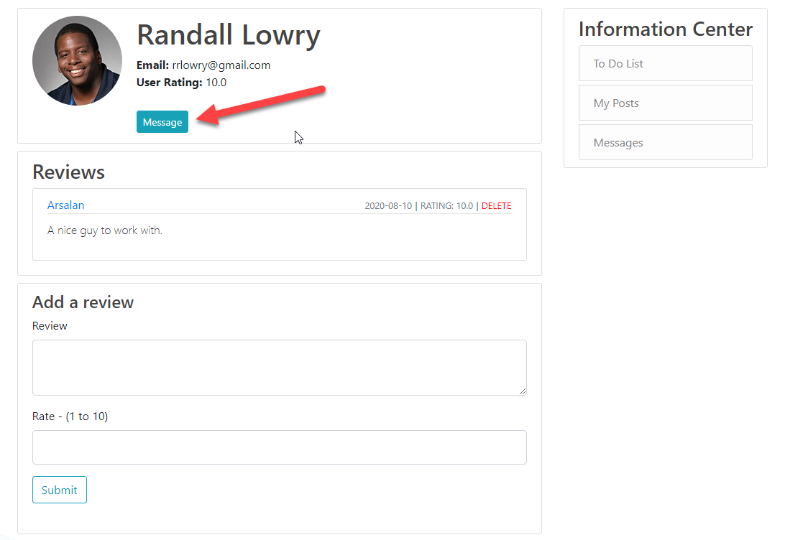
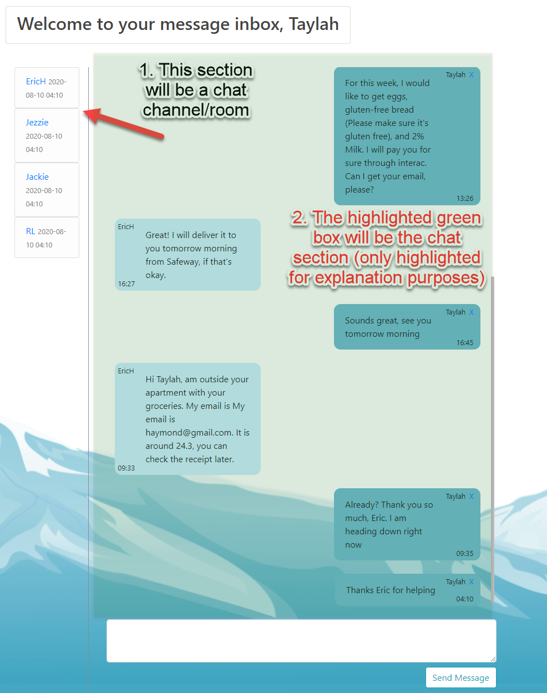
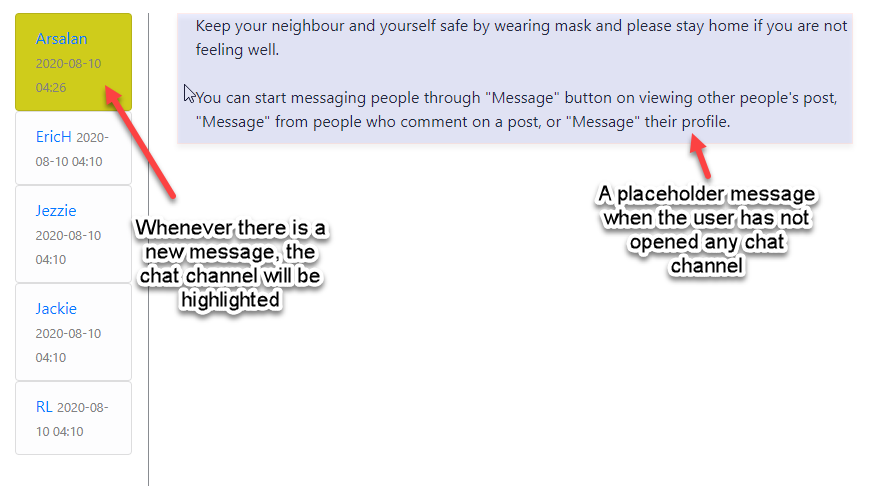
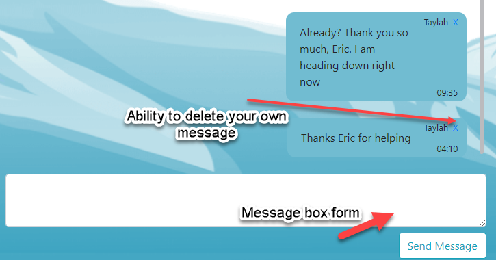
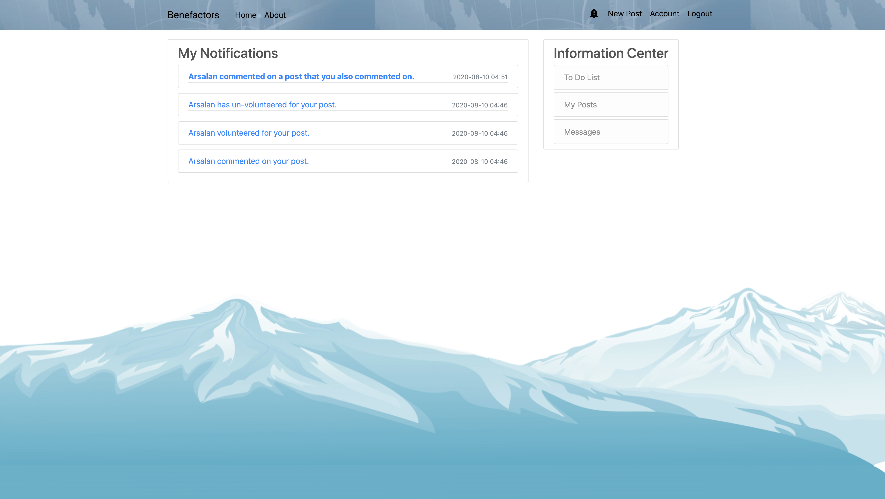

# Benefactors
The recent pandemic has altered the way of life for a lot of people across the globe. Some communities have been impacted so severely that basic necessities like delivery of food and medicines to quarantined neighbourhoods has become a formidable challenge. To mitigate the situation, we envisioned a platform to bring people together while practicing social distancing. Benefactors allows people in need to connect with volunteers to tackle essential services and errands efficiently and at no cost. Expected services include, delivery, shopping, medical supplies, and others.


# Table of Contents
1. [Installation](#installation)
    1. [Requirements](#requirements)
    2. [To Run](#to-run)
    3. [To Terminate](#to-terminate)
2. [Getting started](#getting-started)
    1. [Create a new account.](#create-a-new-account.)
    1. [View Profile and Activities.](#view-profile-and-activities.)
    1. [Update your profile picture.](#update-your-profile-picture.)
    2. [Need assistance? Create a new post.](#need-assistance-create-a-new-post)
    3. [Want to help? Volunteer for a task.](#want-to-help-volunteer-for-a-task)
    4. [Want to know more about a task? Comment on the post.](#want-to-know-more-about-a-task-comment-on-the-post)
    5. [Want to reach out directly? Direct message the user.](#want-to-reach-out-directly-direct-message-the-user)
    6. [Want to find nearby amenities? Find it using Google maps integration.](#want-to-find-nearby-amenities-find-it-using-google-maps-integration)
    7. [Want to find postings in a specific area? Find it using advance search.](#want-to-find-postings-in-a-specific-area-find-it-using-advance-search)
    8. [Want to appreciate a user? Review the user.](#want-to-appreciate-a-volunteer-review-the-user)
    9. [You will never miss an update with real time notifications.](#you-will-never-miss-an-update-with-real-time-notifications.)
    10. [Want to support the platform? Consider donating via credit/debit card.](#want-to-support-the-platform-consider-donating-via-creditdebit-card.)

3. [Inspiration](#inspiration)

## Installation

#### Requirements
1. Docker & Docker Compose
2. Python 3.0+


#### To Run
```
1. git clone https://csil-git1.cs.surrey.sfu.ca/amacknoj/orca.git
2. cd deployment
3. docker-compose build && docker-compose up
4. Go to http://localhost:8080/
```

#### To Terminate
```
1. docker-compose down -v
2. docker system prune -f
```


## Getting started
#### Create a new account.
1. SignUp 


#### View profile and activities.
Want to view your profile and keep track of your activities? Head on over to your account page.


#### Update your profile picture.
1. blah
2. blah 
3. blah

#### Need assistance? Create a new post.
1. blah
2. blah 
3. blah

#### Want to help? Volunteer for a task.
1. blah
2. blah 
3. blah

#### Want to know more about the task? Comment on the post.
1. User can view comments, message the comment's author, delete (if you are the owner comment)


#### Want to reach out directly? Direct message the user - There are three ways to contact the user
1. Through the Post Author Message Button

2. Through the Post Comment | Message button (This is intended mainly for the post author, but also available to post viewers) 

3. Through Profile Page


#### Interface for direct message - The direct message will not be auto-refreshed; however, the user will know when a new message appears.
- Every time the user sends a message, if scrollable it will auto-scroll to the bottom.
- The message will be shown on the right if you are the sender
1. This screenshot below is a user interface for messages

2. Here is the highlighted part whenever a new message appears

3. Messages can also be deleted using the X button on the corner


#### Want to find nearby amenities? Find it using Google maps integration.
1. blah
2. blah 
3. blah

#### Want to find postings in a specific area? Find it using the advance search filter.
1. blah
2. blah 
3. blah

#### Want to appreciate a user? Review the user. 
Your feedback is highly appreciated and will help us to improve our ability to serve you and other users of our web sites.
For your convenience, we have designed a simple review form with description and user ratings. 


#### You will never miss an update with real time notifications.
Head on over to your notification center in order to view your most up to date notifications! You can access this via the bell icon in your navigation bar.



#### Want to support the platform? Consider donating via credit/debit card.
Benefactors is a non-profit social welfare website for the people, by the people. Your continued donations keep Benefactors running.
For your convenience, we have implemented an online payments via Stripe which accepts Visa, Mastercard, American Express, etc.

Test payments using the following sample Visa card.
```
VISA        4242424242424242
CVC         100
DATE        10/25
```

## Inspiration
1. Flask tutorial - https://www.youtube.com/user/schafer5
2. Docker tutorial - https://testdriven.io/blog/dockerizing-flask-with-postgres-gunicorn-and-nginx/