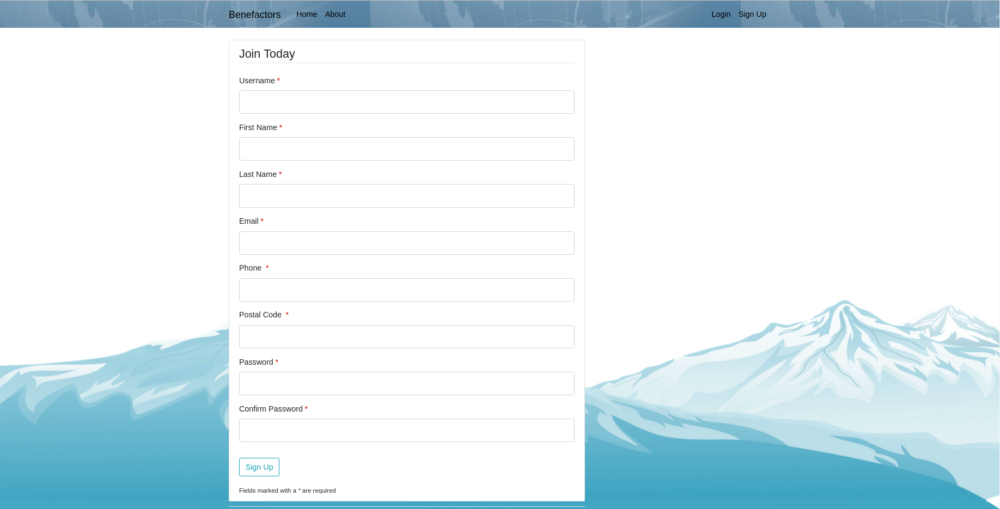
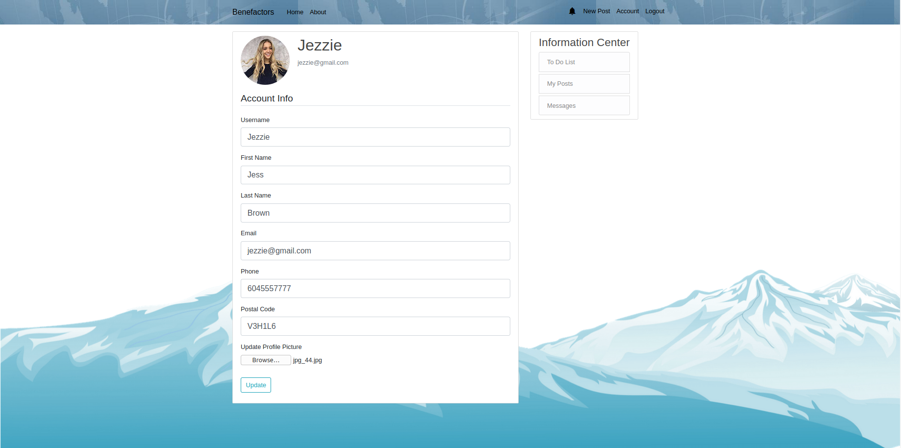
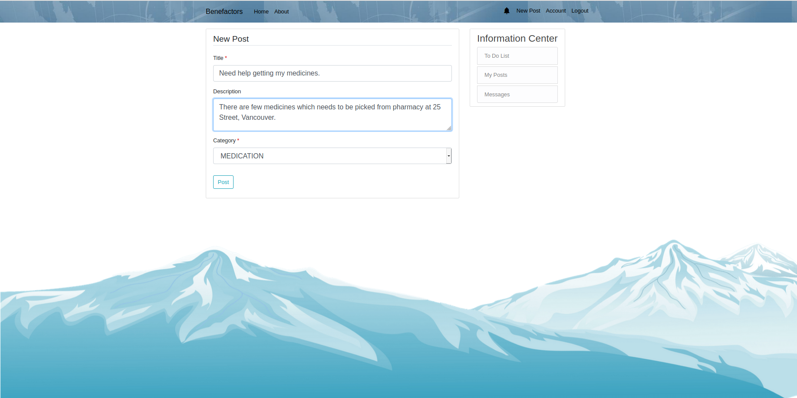
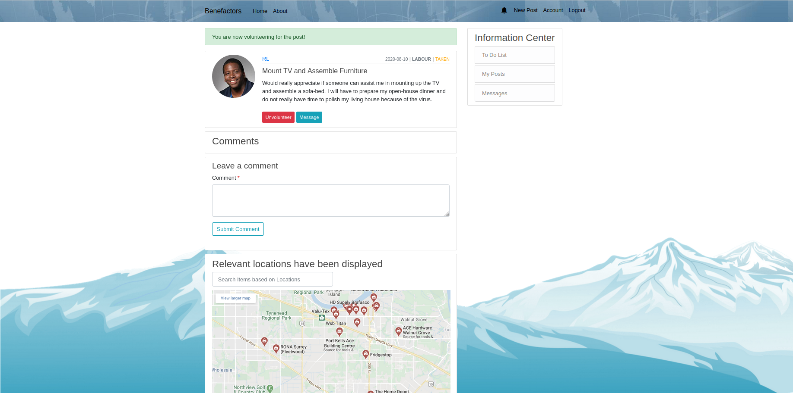

# Benefactors
The recent pandemic has altered the way of life for a lot of people across the globe. Some communities have been impacted so severely that basic necessities like delivery of food and medicines to quarantined neighbourhoods has become a formidable challenge. To mitigate the situation, we envisioned a platform to bring people together while practicing social distancing. Benefactors allows people in need to connect with volunteers to tackle essential services and errands efficiently and at no cost. Expected services include, delivery, shopping, medical supplies, and others.


# Table of Contents
1. [Instructions](#instructions)
    1. [Requirements](#requirements)
    2. [To Run](#to-run)
    3. [To Terminate](#to-terminate)
    4. [Demo profile credentials](#demo-profile-credentials)
2. [Getting started](#getting-started)
    1. [Create a new account.](#create-a-new-account)
    1. [View profile and activities.](#view-profile-and-activities)
    1. [Update your profile.](#update-your-profile)
    2. [Need assistance? Create a new post.](#need-assistance-create-a-new-post)
    3. [Want to help? Volunteer for a task.](#want-to-help-volunteer-for-a-task)
    4. [Want to know more about a task? Comment on the post.](#want-to-know-more-about-a-task-comment-on-the-post)
    5. [Want to reach out directly? Direct message the user.](#want-to-reach-out-directly-direct-message-the-user)
    6. [Want to find nearby amenities? Find it using Google maps integration.](#want-to-find-nearby-amenities-find-it-using-google-maps-integration)
    7. [Want to find postings in a specific area? Find it using the advance search.](#want-to-find-postings-in-a-specific-area-find-it-using-the-advance-search)
    8. [Want to appreciate a user? Review the user.](#want-to-appreciate-a-user-review-the-user)
    9. [You will never miss an update with real time notifications.](#you-will-never-miss-an-update-with-real-time-notifications)
    10. [Want to support the platform? Consider donating via credit card.](#want-to-support-the-platform-consider-donating-via-credit-card)
3. [Inspiration](#inspiration)

## Instructions

#### Requirements
1. Docker & Docker Compose
2. Python 3.0+


#### To Run
```
1. git clone https://csil-git1.cs.surrey.sfu.ca/amacknoj/orca.git
2. cd deployment
3. docker-compose build && docker-compose up
4. Go to http://localhost:8080/
```

#### To Terminate
```
1. docker-compose down -v
2. docker system prune -f
```

#### Demo Profile Credentials
```
User Name: Jess Brown
Email: jezzie@gmail.com
Password: 123123123
```


## Getting started
#### Create a new account.
Create a new account to have full access to the website. Sign up is just a one step process.


#### View profile and activities.
Head on over to your account page to view your profile, posts, to-do list, and more! You can do this by clicking "Account" in your navigation bar.


#### Update your profile.
Once you have created your account you can always update your information including profile picture.


#### Need assistance? Create a new post.
To create a new post click on the "New Post" button in your navigation bar. Add title, description and category and click post.



#### Want to help? Volunteer for a task.
To volunteer for a post, select a post from the home screen by clicking on the post's title. You'll get redirected to post page where you will find a volunteer button.
You can only volunteer for other people's posts which are OPEN. Once you've volunteered for a post, you do have an option to un-volunteer as well.


#### Want to know more about a task? Comment on the post.
To learn more about the task, head over to the post and leave a comment as shown below.


#### Want to reach out directly? Direct message the user.
Direct message option is available on multiple locations for your convenience.  
1. It is available on users' post.

2. It is available on users' comments

3. It is available on users' profile page.


##### Direct Message Interface

1. Direct Message UI

2. Channel gets highlighted when a new message arrives.

3. Messages can be deleted using the X button.


#### Want to find nearby amenities? Find it using Google maps integration.
1. blah
2. blah 
3. blah

#### Want to find postings in a specific area? Find it using the advance search.
1. blah
2. blah 
3. blah

#### Want to appreciate a user? Review the user. 
Your feedback is highly appreciated and will help us to improve our ability to serve you and other users of our web sites.
For your convenience, we have designed a simple review form with description and user ratings. You can review users by heading to their profile.


#### You will never miss an update with real time notifications.
Head on over to your notification center in order to view your most up to date notifications! You can access this via the bell icon in your navigation bar.


#### Want to support the platform? Consider donating via credit card.
Benefactors is a non-profit social welfare website for the people, by the people. Your continued donations keep Benefactors running.
For your convenience, we have integrated an online payment via Stripe which accepts Visa, Mastercard, and American Express.
You can make a donation, by heading to the About page using the button available on the navigation bar where you will find an option to make a payment.

Test payments using the following sample Visa card.
```
VISA        4242424242424242
CVC         100
DATE        10/25
```


## Inspiration
1. Flask tutorial - https://www.youtube.com/user/schafer5
2. Docker tutorial - https://testdriven.io/blog/dockerizing-flask-with-postgres-gunicorn-and-nginx/